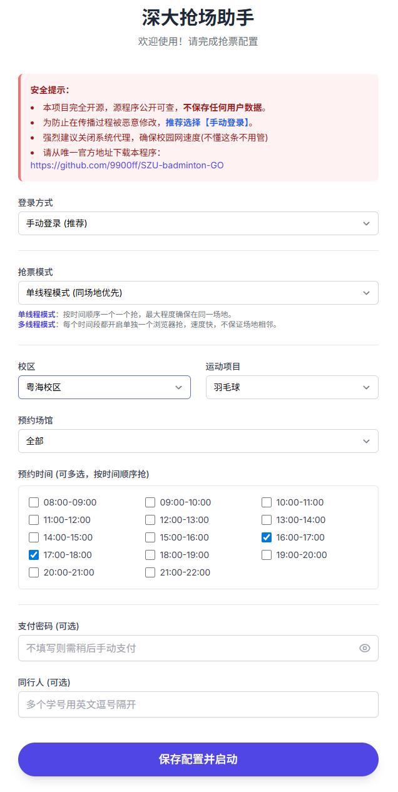

# 深圳大学羽毛球体育场馆自动预约脚本，无需配置环境，无需账号密码

**下载地址**：https://github.com/9900ff/SZU-badminton-GO/releases

**github项目发布地址**：https://github.com/9900ff/SZU-badminton-GO

下载请点击网页右侧Releases，下载最新SZU-badminton-GO.zip后缀压缩包

## 说明

本项目是基于 [Cooduck/Ticket_grabbing_system](https://github.com/Cooduck/Ticket_grabbing_system) 开发的深圳大学自动预约羽毛球场脚本。

**本项目已将Python环境、Chrome浏览器及对应驱动打包，并通过网页界面进行配置，实现了真正的“开箱即用”，无需在电脑上额外安装或配置任何环境。**

脚本包含自动登录、同时抢多个空闲场地、添加同行人、体育经费支付等功能。该脚本仅用于选择第二天的场地。

## 用户配置界面
**可以选择无需账号密码、无需支付密码，确保账号安全**

## 更新说明

### v1.4.1
小更新，修改了用户配置界面的功能说明

### v1.4
重大版本迭代，添加了多线程抢场地功能。实现了多开浏览器同时选择不同时间段场地

### v1.3.2
小更新，添加了多时间段注意事项，多时间段下建议不填写支付密码和同行人。未来有时间优化这部分代码

### v1.3.1
小更新，删除了无用了time.sleep，优化了页面跳转逻辑

### v1.3
设置了优先手动登录

为浏览器界面加上了部分输出，让用户更加直观看到当前状态

修复了多时间段选择下由于网络延迟，刷新慢导致的程序失败

修复了体育场馆可以多选的bug

### v1.2

添加了多时间段选择功能

优先同场地机制

### v1.1

更加人性化的网页端抢票信息管理

支持手动登录，无需账号密码，确保用户隐私

### v1.0

打包python依赖、浏览器驱动等全部依赖。无需手动配置，开箱即用

添加随机抢场功能

